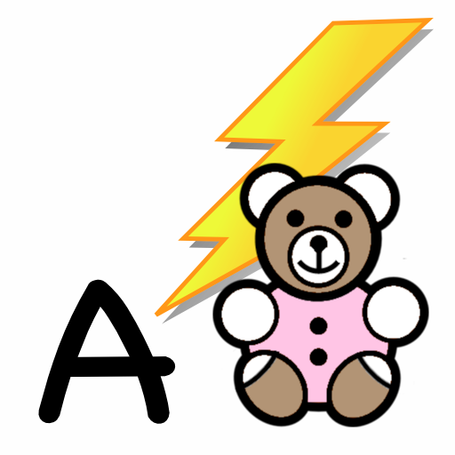

# EllieSoft
An enormous collection of iOS apps, written in _Phonegap_ (aka _Cordova_) and _MonoTouch_ (aka _Xamarin_).

## Background

  
PhoneGap

_PhoneGap_ was the framework which became _Cordova_ after it was acquired by _Adobe_.  This is essentially a
web page (_NSWebView_ on _iOS_) running locally.  _PhoneGap_ provides additional functionality to access
hardware on the host platform eg camera, pictures, contacts, but none of these apps needed that.

The main attraction of _PhoneGap_ is that it provides a reasonable way to develop cross-platform apps.
The downside is that not all native functionality is available or accessible.  Further, any UI is
constrained by what is available in a web page.  However, for the types of apps I was developing at the time, 
this was an acceptable compromise.

These were written c2008-c2011 and probably do not show the best practices for Javascript as I was just
learning Javascript and fumbling my way through.  However, in my defence,  "Shipping code trumps everything"!

  
MonoTouch

_MonoTouch_ was a C# wrapper over _iOS_ APIs, originally developed by a team led by _Miguel de Icaza_ when he
was at _Novell_.  The project was cancelled and the team fired.  However, a clean room implementation emerged 
soon after in the form of _Xamarin_, featuring virtually all of the former _Novell_ team.  _Xamarin_ was an
immediate commercial success and soon merged their changes into the _MonoTouch_ code base.  _Microsoft_
eventually bought _Xamarin_ and, as they say, the rest is history!

The main attraction of _MonoTouch_ is using C# instead of _Objective-C_.  Further, it is possible to use many
existing .NET libraries.  The downside was the early versions were buggy and many _iOS_ APIs were not available.
However, much credit is due to the _MonoTouch_ team who were very responsive, iterated at a great rate, and
released new versions very often.

## Apps

### Alphabet Flash

'Alphabet Flash' is a fun app for children up to 5 years old to learn the shapes and sounds of the alphabet.

For those mums and dads in a rush, here's an executive summary of features:

- upper case letters
- lower case letters

- male voice
- female voice
- child voice
- phonic sound
- US and British pronounciations

- sequential letters
- random letter mode

- simple, intuitive interface

Let your child choose from several voice-overs including a special phonics voice. This lets your child learn the sound associated with each letter. 'Alphabet Flash' has pronounciations for US and British alphabets so your child learns the correct sounds for your location.

Start your child off by trying the alphabet in sequence.  Once he or she has mastered that, they can try the more challenging 'random' mode.

Large, fun buttons and a simple to use interface make it easy for your child to get started and stay engaged.

'Alphabet Flash' is a universal app, so it will work in native resolution on your iPhone, iPod Touch and iPad for the one price.

### Alphabet Tracer

TODO

### Amazing+

TODO

### asciiART

TODO

### Bullseye

TODO

### Detangle

TODO

### Dodge Ball Plus

TODO

### Funny Amazon Reviews

TODO

### Hiragana Tracer

TODO

### iBooze

TODO

### iHalma

TODO

### Spotty Dottie HD

TODO

### Time Flash

TODO

### Trek

TODO

### Web Neko

TODO

### ZombieMatic

TODO

