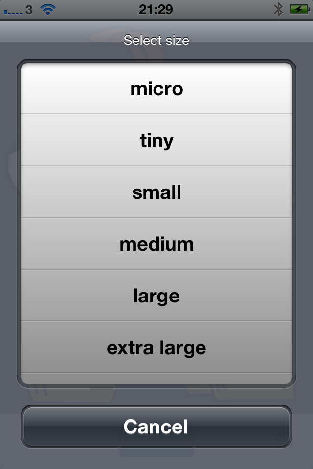
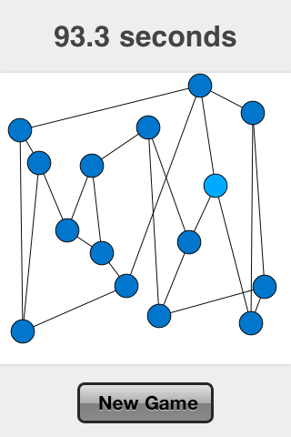
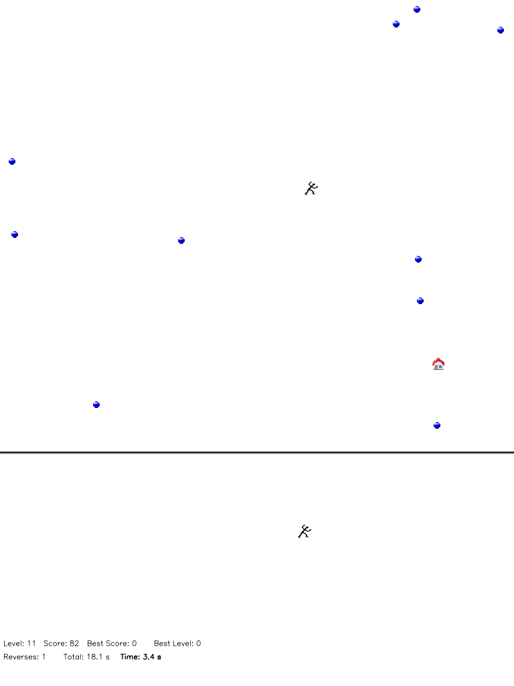
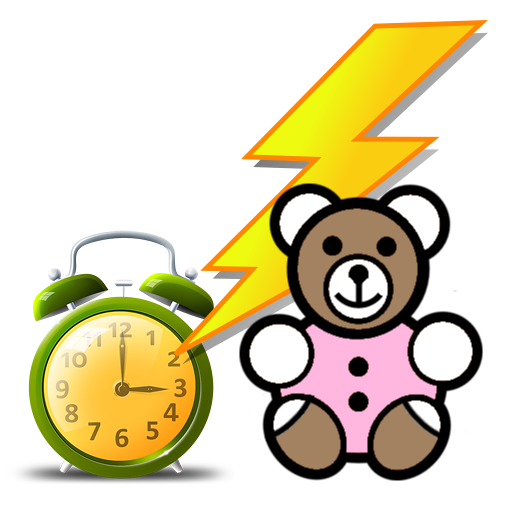
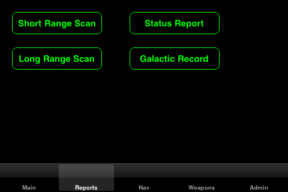
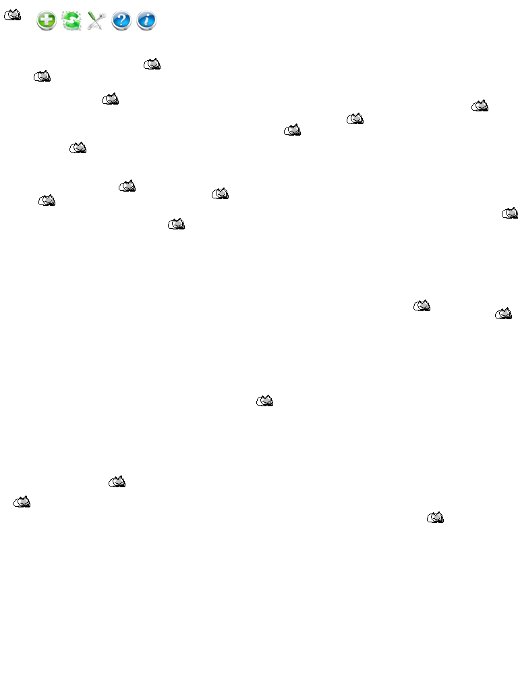

# EllieSoft
An enormous collection of iOS apps, written in _Phonegap_ (aka _Cordova_) and _MonoTouch_ (aka _Xamarin_).

## Background

  
PhoneGap

_PhoneGap_ was the framework which became _Cordova_ after it was acquired by _Adobe_.  This is essentially a
web page (_NSWebView_ on _iOS_) running locally.  _PhoneGap_ provides additional functionality to access
hardware on the host platform eg camera, pictures, contacts, but none of these apps needed that.

The main attraction of _PhoneGap_ is that it provides a reasonable way to develop cross-platform apps.
The downside is that not all native functionality is available or accessible.  Further, any UI is
constrained by what is available in a web page.  However, for the types of apps I was developing at the time, 
this was an acceptable compromise.

These were written c2008-c2011 and probably do not show the best practices for Javascript as I was just
learning Javascript and fumbling my way through.  However, in my defence,  "Shipping code trumps everything"!

  
MonoTouch

_MonoTouch_ was a C# wrapper over _iOS_ APIs, originally developed by a team led by _Miguel de Icaza_ when he
was at _Novell_.  The project was cancelled and the team fired.  However, a clean room implementation emerged 
soon after in the form of _Xamarin_, featuring virtually all of the former _Novell_ team.  _Xamarin_ was an
immediate commercial success and soon merged their changes into the _MonoTouch_ code base.  _Microsoft_
eventually bought _Xamarin_ and, as they say, the rest is history!

The main attraction of _MonoTouch_ is using C# instead of _Objective-C_.  Further, it is possible to use many
existing .NET libraries.  The downside was the early versions were buggy and many _iOS_ APIs were not available.
However, much credit is due to the _MonoTouch_ team who were very responsive, iterated at a great rate, and
released new versions very often.

## Apps

### Alphabet Flash 

'Alphabet Flash' is a fun app for children up to 5 years old to learn the shapes and sounds of the alphabet.

For those mums and dads in a rush, here's an executive summary of features:

- upper case letters
- lower case letters

- male voice
- female voice
- child voice
- phonic sound
- US and British pronounciations

- sequential letters
- random letter mode

- simple, intuitive interface

Let your child choose from several voice-overs including a special phonics voice. This lets your child learn the sound associated with each letter. 'Alphabet Flash' has pronounciations for US and British alphabets so your child learns the correct sounds for your location.

Start your child off by trying the alphabet in sequence.  Once he or she has mastered that, they can try the more challenging 'random' mode.

Large, fun buttons and a simple to use interface make it easy for your child to get started and stay engaged.

'Alphabet Flash' is a universal app, so it will work in native resolution on your iPhone, iPod Touch and iPad for the one price.

  
Screenshots

  
  

  

  

  

  

  

    

### Alphabet Tracer 

AlphabetTracer is a fun app for children up to 5 years old to learn the shapes, signs and sounds of the alphabet.

For those mums and dads in a rush, here's an executive summary of features:

- American sign language
- British sign language
- letter stroke formation

- upper case letters
- lower case letters

- male voice
- female voice
- child voice
- phonic sound
- US and British pronounciations

- sequential letters
- random letter mode

- large, child friendly, colour choice
- simple, intuitive interface

- shake to erase (kids love this!)

Your child will learn all the signs of the alphabet for both American sign language (ASL) and British sign language (BSL). Switching to 'letter formation' mode lets your child learn the correct strokes for writing both upper and lower case letters.

Let your child choose from several voice-overs including a special phonics voice. This lets your child learn the sound associated with each letter. AlphabetTracer has pronounciations for US and British alphabets so your child learns the correct sounds for your location.

Start your child off by trying the alphabet in sequence.  Once he or she has mastered that, they can try the more challenging 'random' mode.

Your child can choose from a large range of funky colours to make their letters their own. Large, fun buttons and a simple to use interface make it easy for your child to get started and stay engaged.

Don't worry if your child makes a mistake; they'll love the 'shake to erase' feature which lets them start again.  Just keep an eye on them to make sure they don't make too many 'deliberate mistakes'!

AlphabetTracer is a universal app, so it will work in native resolution on your iPhone, iPod Touch and iPad for the one price.

  
Screenshots

  
  

  

  

  

  

  

  

  

  

  

### Amazing+ 

Amazing is a maze solving, puzzle game. Just help Bearnadette get through the maze to the finish before she runs out of time. Don't worry if you can't find the way as there's always the option of showing the path!

    - infinite number of levels for lots of fun
    - power ups for extra time and points
    - penalties for time and points
    - 'rocket mode' for a temporary speed boost
    - 'Hall of Fame' to record your high score
    - show the path (but it'll cost you!)

Can you make it out in time?

  
Screenshots

  
  

  

  

  

  

  

  

  

### asciiART 

'asciify' takes your digital pictures and turns them into stunning, HTML, text based web pages using nothing but letters and numbers.  Turn the clock back and view your pictures as ASCII art.

A simple, streamlined, user interface lets you choose an image and select an output size.  View the results and then send it via email, Facebook, Twitter; or save it to your Photo Album or iTunes file sharing.

'asciify' features:
  * uncluttered, intuitive interface
  * color ASCII, HTML output
  * choice of output sizes
  * social sharing via:
    * email
    * Facebook
    * Twitter
    * Photo Album
    * iTunes

Please note that 'asciify' does a LOT of computing, so it will take a while on large images but the results are worth the wait.

Remember - everything looks better in ASCII!

  
Screenshots

  
  

  

  

  

  

  

### Bullseye 

How quick are you?  How accurate are you?  Are you both quick *and* accurate?
Bullseye is an addictive, fast paced game which demands both speed and accuracy.
Try to hit the moving targets in a series of levels which rewards speed and
punishes inaccuracy.

  
Screenshots

  
  

  

  

### Detangle 

Ever had to detangle a ball of wool?  Was it frustrating, challenging and rewarding?
When you finished, did you mess it up and start all over again, just for the heck of it?
Did you try and do it quicker than you did last time?

Detangle is your virtual ball of wool.  Try as many times as you like, as often as you like,
when you like.  Keep trying until you  beat your best score.

This is a universal app, so it will work in native resolution on your iPhone, iPod Touch and iPad for the one price.

  
Screenshots

  
  

  

  

  

  

  

  

  

  

### Dodge Ball Plus 

Dodge Ball Plus is a fast paced, addictive action game which is simple to learn but difficult to master.  Use the control pad at the bottom of the screen to run towards the house whilst avoiding the balls.  How easy can it be?  Oh, did we mention that more balls appear on each level and that they get faster?  You only have a limited amount of time, so you you'll have to be quick!

  
Screenshots

  
  

  

  

  

  

  

### Funny Amazon Reviews 

Ever wondered just why that big name, high end $250 HDMI cable is better than a generic $2 one?  What makes a simple ballpoint pen so special to so many people?  Just what is the attraction of the t-shirt with three wolves howling at the moon?  Why does an online retailer offer fresh whole rabbit, milk and uranium ore?

Somebody must buy these things but what do they think about them?  Find out with this app which lists unusual (and every day) products along with people's reviews.  There are over 50 products with laugh out loud reviews which will have you crying with laughter!

[Please note that this app requires an active internet connection]

  
Screenshots

  
  

  

  

  

### Hiragana Tracer 

'Hiragana Tracer' is a fun app for children (and adults!) to learn the shapes, strokes and sounds of the Japanese alphabet.

For those mums and dads in a rush, here's an executive summary of features:

- complete set of characters
- correct character stroke order

- native Japanese pronounciations

- sequential character mode
- random character mode

- large, child friendly, colour choice
- simple, intuitive interface

Your child will learn all the characters and, importantly, their correct stroke order. Each character has native Japanese pronounciations, to help your child speak like a native.

Your child can choose from a large range of funky colours to make their letters their own. Large, fun buttons and a simple to use interface make it easy for your child to get started and stay engaged.

'Hiragana Tracer' is a universal app, so it will work in native resolution on your iPhone, iPod Touch and iPad for the one price.

  
Screenshots

  
  

  

  

  

  

  

  

  

### iBooze 

Confused about which beer on special offer is *really* the best value?  Let iBooze figure this out for you by calculating how much you're really paying for your beer.  Just input a few parameters and iBooze will quickly let you know the real price and allow you to easily compare offers for the best deal.

  
Screenshots

  
  

  

  

### iHalma 

Halma is a board game invented in 1883 or 1884 by an American plastic surgeon at Harvard Medical School, George Howard Monks. The inspiration was an English game called Hoppity, which was devised in 1854.
    
The goal of the game is to transfer all of your pieces from one corner to the opposite corner in the least number of moves.

  
Screenshots

  
  

  

  

  

  

  

  

  

### Spotty Dottie HD 

Connect the dots with Spotty Dottie, the spotty dog!

Let your child use a beautiful, CoverFlow interface to browse through a selection of almost 70 join the dots puzzles.
Once a puzzle is selected, a streamlined interface allows your child to concentrate on drawing without distractions. Each puzzle features up to 50 dots to connect for extended enjoyment.
After they complete the puzzle, you can save the image to your photo album to show off their work.

'Spotty Dottie HD' features:
  * large selection of puzzles (almost 70 now with more planned)
  * intuitive CoverFlow interface for browsing images
  * seamless pan and zoom lets your child focus on drawing
  * 'magic circle' follows your child's finger to let them know where they're drawing
  * easily undo any mistakes
  * save your child's work to your photo album

Some quotes from our testers:

  "I put this on my iPhone and Ellie [five year old daughter] didn't want to give it back!"
    - Mandy, Cambridge

  "Kept my seven year old entertained on the plane all the way to Majorca!"
    - Linda, London

  "This is what the iPad was made for.  Best kids app by a long way."
    - Cecile, Cambridge

  "My daughter *LOVES* this app!  She hasn't stopped using it since you gave it to us."
    - Chrystal, London

  "Smooth, intuitive interface.  My [six year old] son picked it up no problem at all."
    - Ian, Cambridge

  "Bit embarassing but I'm saving my daughter's doodles and emailing them to my husband!"
    - Kelly, York

  "If you have an iPad, this is *awesome* and will bring a smile to the face of any child (or adult!)."
    - Karen, London

This is a universal app, so it will run on all your iDevices for the one price.

  
Screenshots

  
  

  

  

  

  

  

  

  

### Time Flash 

'Time Flash' is a fun app for children to learn to tell the time.


For those mums and dads in a rush, here's a quick summary of features:
  * male or female voices
  * optionally disable all voices

  * random time selection
  * analog, digital or random clock modes

  * simply touch the clock to read out the time

  * large, simple, intuitive and child friendly interface

Let your child choose from either male or female voice-overs.  If they find it too easy, switch turn off the voices so they have to do it unassisted.

Select analog or digital clocks so your child can tell the time with either type of clock.

Still too easy for them, then turn on random clock mode to keep your child on their toes!

Large, fun buttons and a simple to use interface make it easy for your child to get started and stay engaged.

  
Screenshots

  
  

  

  

  

  

  

  

  

### Trek 

Trek is a faithful recreation of the classic, text mode, space exploration and combat game.  Go around the universe at warp speed, battle enemies and dock at starbases for repairs.  You can't afford to hang around as the enemy is everywhere and there is only a limited amount of time.
 
Trek features:
  * same classic game engine underneath
  * retro green screen look
  * streamlined and modern interface
  * easy access to all commands
  * load and save games
  * touch screen optimised interface
  * supports iPhone and iPad
  * separate interfaces for iPhone and iPad

  
Screenshots

  
  

  

  

  

  

  

  

  

  

  

  

  

  

### Web Neko 

Now all your favourite cats are on your favourite phone!  Neko comes to the iPhone with WebNeko.  Choose from a selection of cats and watch her chase your finger.  If you're brave, try cat herding with a whole litter of Nekos!

  
Screenshots

  
  

  

  

  

  

  

  

  

### ZombieMatic 

Brains... BRAINS... B*R*A*I*N*S!  The undead are alive and on your iPhone or iPod Touch.  Frighten your friends with an impressive collection of over 100 groans, moans and screams.  ZombieMatic brings the undead to life!

  
Screenshots

  
  

  

